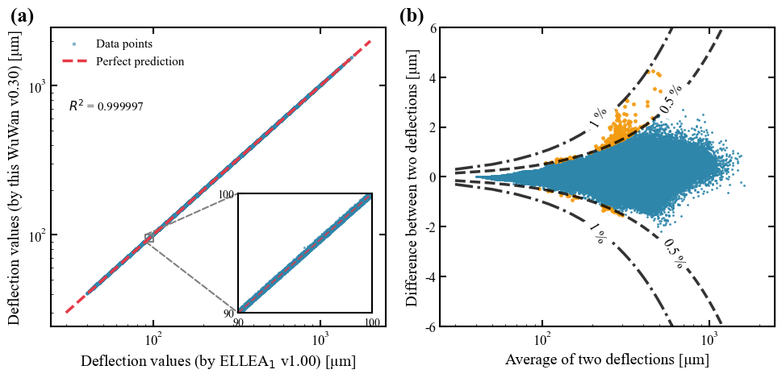
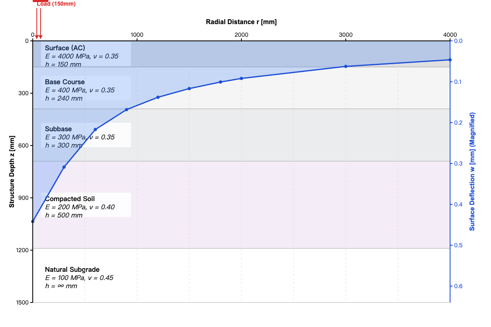

# WuWan: High-Performance Layered Elastic Half-Space Solver

[](https://opensource.org/licenses/Apache-2.0)
[](https://www.python.org/)
[](https://isocpp.org/)
[]()

## 📋 Overview

**WuWan** is a high-performance computational library for forward and inverse analysis of layered pavement systems. It solves deflections in **5-layer elastic half-space** structures with exceptional speed and accuracy, making it ideal for:

- 🛣️ **Pavement Engineering**: FWD (Falling Weight Deflectometer) data back-calculation
- 🔬 **Research**: Large-scale parametric studies and sensitivity analysis  
- 🏗️ **Structural Assessment**: Real-time moduli estimation for quality control

Built with a modern **C++17 backend** (relying on Boost and Eigen) and wrapped for **Python**, it leverages analytical gradients and custom linear algebra optimizations to achieve millisecond-level inversions.

---

## 🚀 Key Features

* **High-Performance Core**: Originally a Cython project, now fully rewritten in C++ for maximum efficiency.
* **Analytical Gradients**: Implements analytical derivatives for Jacobian calculations, significantly outperforming finite difference methods in stability and speed.
* **Advanced Back-Calculation**:
    * Utilizes `scipy.optimize` combined with high-speed C++ gradient providers.
    * Solves inverse problems in **tens of milliseconds**.
* **Robust Error Modeling**: Supports noise injection for thickness, deflection, load, and sensor positioning to simulate real-world measurement uncertainties.

---

## 🛠 Installation & Dependencies

### System Requirements

- **Operating Systems**: Linux, macOS, Windows
- **Python**: 3.8 or higher
- **C++ Compiler**: Supporting C++17 (GCC 7+, Clang 5+, MSVC 2017+)

### Prerequisites
* **C++ Compiler** supporting C++17
* **Boost Math Library**
* **Eigen3 Linear Algebra Library**
* **Python 3.x**

### Building from Source

#### Clone the Repository
```bash
git clone https://github.com/lewiswan/WuWan.git
cd WuWan
```

#### Option A: Standard Installation (Recommended for Users)

This method automatically sets up a build environment, downloads necessary C++ libraries (Eigen & Boost), and compiles the project.
```bash
pip install .
```

**Note:** The first installation may take a few minutes as it downloads the Boost C++ headers.

#### Option B: Fast Re-installation (Recommended for Developers)

If you are modifying the C++ code or reinstalling frequently, use this method. It utilizes build isolation disabled to persist the CMake cache. This prevents re-downloading Boost/Eigen on every build, reducing compile time to seconds.

1. Install build tools (one-time setup):
```bash
pip install cmake ninja pybind11
```

2. Fast install command:
```bash
pip install . --no-build-isolation --no-deps --force-reinstall
```

---

## 🧠 Methodology

The core algorithm solves the Layered Elastic Theory (LET) equations using advanced numerical techniques:

1.  **Hankel Transform**: The integral transform is converted into algebraic equations using high-precision **Gauss-Legendre quadrature**.
2.  **System Solving**: Instead of using generic solvers, WuWan employs a **custom implementation of LU decomposition**. This is specifically optimized for the sparse, banded structure of the 5-layer system matrices, reducing memory overhead and computation time.
3.  **Gradient Computation**: The Jacobian matrix is computed via **analytical derivation** of the stiffness matrix. This allows for precise sensitivity analysis without the computational overhead or truncation errors associated with numerical differentiation.

### Why It's Fast

| Technique | Benefit |
|-----------|---------|
| Gauss-Legendre Quadrature | High-precision numerical integration with optimal node placement |
| Zero-Segmented Integration | Divides integration domain at Bessel function zeros for enhanced accuracy |
| Asymptotic Approximation | Reduces computational complexity for large integration points |
| C++17 + Eigen | SIMD-vectorized linear algebra |
| Analytical gradients | 3-5× faster than finite differences |
| Custom sparse solver | 50% memory reduction vs. generic LU |
| Zero-copy interface | Minimal Python/C++ data marshalling overhead |

---

## 📊 Performance Benchmarks

**Test Platform**: MacBook Pro M4, Single-threaded

| Operation | Batch Size | Computation Time | Note |
| :--- | :--- | :--- | :--- |
| **Forward Calculation** | 10,000 calls (10 points/call) | **~0.9 seconds** | Pure deflection calculation |
| **Forward + Gradient** | 10,000 calls (10 points/call)| **~2.0 seconds** | Deflection + Jacobian w.r.t moduli |
| **Inverse Analysis** | Single Basin | **~5 - 50 ms** | Dependent on convergence criteria |

> **Note:** The solver is optimized to handle large-scale batch processing for sensitivity analysis and probabilistic inversion.

---

## 📉 Validation: WuWan vs. ELLEA

To ensure numerical reliability, **WuWan (v0.30)** was rigorously benchmarked against the established [**ELLEA**](https://findit.dtu.dk/en/catalog/689b3af6d060d500e9ed1ce2) **(v1.00)** solver.

### 1. Dataset Generation

The validation study covered **500,000 distinct structural combinations**, resulting in a total of **5,000,000 evaluation points**. The structural parameters were randomly generated within the following physical ranges to cover a wide spectrum of pavement conditions:

| Layer | Thickness Range ($h$) [mm] | Modulus Range ($E$) [MPa] | Poisson's Ratio |
| :---: | :--- | :--- | :--- |
| **1** | $40 - 450$ | $1,000 - 25,000$ | 0.25 – 0.35 |
| **2** | $150 - 300$ | $100 - 8,000$ | 0.30 – 0.40 |
| **3** | $150 - 600$ | $80 - 600$ | 0.30 – 0.40 |
| **4** | $0 - 500$ | $20 - 500$ | 0.35 – 0.45 |
| **5** | $\infty$ (Half-space) | $15 - 150$ | 0.40 – 0.45 |

### 2. Statistical Agreement

The results demonstrate exceptional fidelity. As illustrated in **Figure (a)**, the calculated deflections align almost perfectly with the theoretical line of equality, achieving a coefficient of determination of **$R^2 = 0.999997$**.

**Figure (b)** details the relative error distribution. The absolute difference between the solvers is negligible for the vast majority of cases:

| Error Range | Percentage of Data | Visual Representation |
| :--- | :--- | :--- |
| **< 0.5%** | **99.9949%** | 🔵 Blue points |
| **0.5% – 1.0%** | **0.0051%** | 🟠 Orange points |
| **> 1.0%** | **0.0000%** | *None* |

### 3. Edge Case Analysis

The minor deviations (orange points) observed in the 0.5%–1.0% range are isolated to **extreme stiffness contrasts**. Specifically, these occur only when a very soft subgrade ($E_5 \approx 15$ MPa) is paired with significantly stiffer upper layers.

In these rare scenarios, numerical discrepancies tend to increase closer to the load application point. However, even under these extreme conditions, the maximum error strictly remains **below 1%**. For all standard pavement structures, WuWan consistently maintains a precision deviation of **< 0.5%**.



---

## ⚡ Quick Start: Forward Calculation

This example demonstrates how to perform a high-speed forward calculation for a 5-layer pavement system and retrieve both deflections and analytical gradients (Jacobian) using the **WuWan** C++ backend.

### 1. Setup Data and Call Solver

The following logic follows the standard workflow: defining the structure, preparing contiguous memory for C++, and executing the solver.

```python
import time
import numpy as np
import pandas as pd
import WuWan_pavement_forward
data = {
        'Layer':            ['Layered System', 'layer #', '1', '2', '3', '4', '5', '', '', '','Stress [MPa]'],
        'Modulus [MPa]':    ['Layered System', 'Modulus [MPa]', '4000', '400', '300', '200', '100', '', '', '','0.95'],
        'Poisson [-]':      ['Layered System', 'Poisson [-]', '0.30', '0.35', '0.35', '0.40', '0.40', '', '', '', 'Radius [mm]'],
        'Thickness [mm]':   ['Layered System', 'Thickness [mm]', '150', '240', '300', '500', 'semi-inf', '', '', '','150'],
        '':  ['', '', '', '', '', '', '', '', '', '', ''],
        'Evaluation point': ['Evaluation point #', '1', '2', '3', '4', '5', '6', '7', '8', '9', '10' ],
        'r [mm]':           ['r [mm]', '0', '300', '600', '900', '1200', '1500', '1800', '2000', '3000', '4000'],
        'Deflection [μm]':  ['Deflection [μm]', '', '', '', '', '', '', '', '', '', ''],
        }
df = pd.DataFrame(data)
df = pd.DataFrame.from_dict(data, orient='index')
df.to_csv('data.csv', index=False)

df_num = df.apply(pd.to_numeric, errors='coerce').fillna(0.0)
arr = df_num.to_numpy()
arr = np.ascontiguousarray(df_num.to_numpy(), dtype=np.float64)
input_data = np.ascontiguousarray(arr.T)
# === Call C++ ===
print("Python: Calling C++...")
ret = WuWan_pavement_forward.Calculation(input_data, calc_grad=True)
end = time.perf_counter()
print("deflections:", ret.result_displacement)
print("grad:", ret.J_E)
```

### 2. Output & Visualization

The solver generates the surface deflection basin profile. Below are the results from the demo:

```Plaintext
Python: Calling C++...
deflections: [0.44186744 0.30873646 0.21676407 0.16808461 0.13797657 0.11674337 
               0.10064475 0.09188363 0.0624335  0.04627289]
grad: [[-2.48956993e-05 -2.35325278e-04 -2.04079722e-04 -2.63150101e-04
  -1.34300592e-03]
 [-5.45282398e-06 -1.37737859e-04 -1.68268547e-04 -2.43524360e-04
  -1.32644585e-03]
 [-8.72171458e-07 -4.12614680e-05 -9.94771277e-05 -1.95007054e-04
  -1.27926249e-03]
 [-6.48066584e-07 -7.45964845e-06 -4.64284696e-05 -1.38462798e-04
  -1.20887387e-03]
 [-6.40643617e-07  6.83431698e-07 -1.78697327e-05 -8.93774172e-05
  -1.12450960e-03]
 [-5.31834037e-07  2.23559776e-06 -4.80736168e-06 -5.30852137e-05
  -1.03451018e-03]
 [-4.05946534e-07  2.41149686e-06  8.08046065e-07 -2.85735311e-05
  -9.45132738e-04]
 [-3.33276661e-07  2.32692214e-06  2.57471518e-06 -1.73096406e-05
  -8.87917836e-04]
 [-1.12120438e-07  1.37095054e-06  3.73979321e-06  5.75100302e-06
  -6.48055323e-04]
 [-3.64239311e-08  5.61953149e-07  2.21478585e-06  7.54918589e-06
  -4.85262516e-04]]
```

*Methodology Note: The left axis represents the physical depth of the pavement layers ($z$). The right axis represents the vertical surface deflection ($w$), which is magnified 1000x for visibility.*

## ⚡ Quick Start: Inverse Calculation

This example demonstrates how to perform back-calculation (inversion) to determine layer moduli from deflection data. This can be executed via the `WuWan_pavement_inverse.py` script or the **WuWanGUI**.

### 3. Inversion Setup & Noise Simulation

To simulate real-world FWD (Falling Weight Deflectometer) conditions, we use a synthetic dataset where the "True" moduli are known ($E_{true} = [8000, 400, 300, 200, 100]$ MPa).

**Random noise** is intentionally added to the input parameters—including all layer thicknesses, sensor positions, and load—before the solver sees them. This tests the robustness of the **WuWan** backend against measurement errors.

| Parameter | Original Value | Added Noise (Simulated Error) | Modified Input (Solver Sees) |
| :--- | :--- | :--- | :--- |
| **Load** | 0.95 MPa | $-0.004$ MPa | **0.946 MPa** |
| **Thickness L1** | 50.0 mm | $-4.70$ mm | **45.30 mm** |
| **Thickness L2** | 200.0 mm | $-0.21$ mm | **199.79 mm** |
| **Thickness L3** | 300.0 mm | $+3.88$ mm | **303.88 mm** |
| **Thickness L4** | 600.0 mm | $+6.56$ mm | **606.56 mm** |
| **Sensor (r=300)** | 300.0 mm | $+1.29$ mm | **301.29 mm** |
| **Sensor (r=600)** | 600.0 mm | $-0.58$ mm | **599.42 mm** |
| **...** | ... | ... | ... |

*(Note: Noise was applied to all 9 sensor positions and deflection readings as shown in the error analysis log.)*

### 4. Results & Visualization

The solver attempts to recover the moduli by minimizing the error between calculated and measured deflections. Despite significant noise in the inputs, the optimizer converges in **0.010 seconds**.

#### Modulus Comparison (True vs. Back-calculated)

The table below visualizes the accuracy of the inversion. Note that due to the added noise in thickness and load, the solver correctly finds the *effective* modulus that satisfies the physical equilibrium, which may deviate slightly from the theoretical "True" value.

| Layer | True Modulus ($E_{true}$) | **Calculated Modulus ($E_{calc}$)** | Deviation |
| :--- | :--- | :--- | :--- |
| **1 (Surface)** | **8000 MPa** | **10330.8 MPa** | +29.1% |
| **2 (Base)** | **400 MPa** | **411.2 MPa** | +2.8% |
| **3 (Subbase)** | **300 MPa** | **292.8 MPa** | -2.4% |
| **4 (Soil)** | **200 MPa** | **195.9 MPa** | -2.1% |
| **5 (Subgrade)** | **100 MPa** | **99.4 MPa** | **-0.6%** |

> **Observation:** The subgrade modulus (Layer 5) is recovered with extremely high accuracy (**0.6% error**), which is critical for structural evaluation. The surface layer shows higher deviation, which is expected when thickness noise (approx. 9% error on L1 thickness) is introduced.

#### Optimization Performance

The **WuWan** C++ backend utilizes analytical gradients (Jacobian) to accelerate convergence.

* **Total Run Time:** `0.006 seconds`
* **Total C++ Calls:** `18`
* **Gradient Calculations:** `7`
* **Final Cost (Residual):** `5.01e-06`

*(Note: Representation of cost reduction over 15 iterations)*

---

## 📖 Documentation

For comprehensive guidance on using WuWan:

- **API Reference**: Detailed documentation of all classes and methods
- **Tutorials**: Step-by-step examples in the `examples/` directory
- **Theory**: Mathematical derivations and implementation details in `docs/theory.pdf`
- **FAQ**: Common questions and troubleshooting tips

---

## 🔮 Roadmap

- [x] **C++ Core Rewrite**: Transformed from Cython to C++ with Eigen/Boost.
- [x] **Forward Calculation & Analytical Gradients**: Implementation of high-speed forward modeling and derivative calculation.
- [x] **Deterministic Back-calculation**: Fast inverse analysis for moduli estimation.
- [ ] **Bayesian Uncertainty Analysis**: Implementation of MCMC or variational inference for posterior distributions (In Progress).
- [ ] **Global Sensitivity Analysis**: Sobol indices or similar methods to quantify parameter influence (In Progress).
- [ ] **Batch Error Simulation**: Wrappers for large-scale Monte Carlo simulations with noise injection.
- [ ] **Multi-core Parallelization**: Leverage multi-threading for batch processing.
- [ ] **3D Visualization Tools**: Interactive visualization of layer structure and deflection basins.

---

## 📄 License

This project is licensed under the **Apache License 2.0** - see the [LICENSE](LICENSE) file for details.

You are free to use, modify, and distribute this software for both commercial and non-commercial purposes, subject to the terms of the license.

---

## 🙏 Acknowledgments

WuWan builds upon decades of research in layered elastic theory and pavement mechanics:

- **Libraries**: Built with [Eigen](https://eigen.tuxfamily.org), [Boost](https://www.boost.org), and [pybind11](https://pybind11.readthedocs.io)
- **Validation**: Benchmarked against [ELLEA](https://findit.dtu.dk/en/catalog/689b3af6d060d500e9ed1ce2) by Technical University of Denmark
- **Theory**: Inspired by foundational work from:
  - Levenberg, E. (2020) - Pavement Mechanics: Lecture Notes
  - Huang, Y.H. (2004) - Pavement Analysis and Design
  - Ullidtz, P. (1998) - Modelling Flexible Pavement Response and Performance

Special thanks to all contributors and the pavement engineering research community.

---

## 🌟 Star History

If you find WuWan useful, please consider giving it a star on GitHub! It helps others discover the project and motivates continued development.

---

**Made with ❤️ for pavement engineers and researchers worldwide**