# WuWan: High-Performance Layered Elastic Half-Space Solver

[](https://opensource.org/licenses/Apache-2.0)
[](https://www.python.org/)
[](https://isocpp.org/)
[]()

## 📋 Overview

**WuWan** is a high-performance computational library for forward and inverse analysis of layered pavement systems. It solves deflections in **5-layer elastic half-space** structures with exceptional speed and accuracy, making it ideal for:

- 🛣️ **Pavement Engineering**: FWD (Falling Weight Deflectometer) data back-calculation
- 🔬 **Research**: Large-scale parametric studies and sensitivity analysis  
- 🏗️ **Structural Assessment**: Real-time moduli estimation for quality control

Built with a modern **C++17 backend** (relying on Boost and Eigen) and wrapped for **Python**, it leverages analytical gradients and custom linear algebra optimizations to achieve millisecond-level inversions.

---

## 🚀 Key Features

* **High-Performance Core**: Originally a Cython project, now fully rewritten in C++ for maximum efficiency.
* **Analytical Gradients**: Implements analytical derivatives for Jacobian calculations, significantly outperforming finite difference methods in stability and speed.
* **Advanced Back-Calculation**:
    * Utilizes `scipy.optimize` combined with high-speed C++ gradient providers.
    * Solves inverse problems in **tens of milliseconds**.
* **Robust Error Modeling**: Supports noise injection for thickness, deflection, load, and sensor positioning to simulate real-world measurement uncertainties.
* **Sensor Location Optimization**: Robust, uncertainty-aware Differential Evolution search for the FWD sensor layout that maximizes the information content of the deflection basin.

---

## 🛠 Installation & Dependencies

### System Requirements

- **Operating Systems**: Linux, macOS, Windows
- **Python**: 3.8 or higher
- **C++ Compiler**: Supporting C++17 (GCC 7+, Clang 5+, MSVC 2017+)

### Prerequisites
* **C++ Compiler** supporting C++17
* **Boost Math Library**
* **Eigen3 Linear Algebra Library**
* **Python 3.x**

### Building from Source

#### Clone the Repository
```bash
git clone https://github.com/lewiswan/WuWan.git
cd WuWan
```

#### Option A: Standard Installation (Recommended for Users)

This method automatically sets up a build environment, downloads necessary C++ libraries (Eigen & Boost), and compiles the project.
```bash
pip install .
```

**Note:** The first installation may take a few minutes as it downloads the Boost C++ headers.

#### Option B: Fast Re-installation (Recommended for Developers)

If you are modifying the C++ code or reinstalling frequently, use this method. It utilizes build isolation disabled to persist the CMake cache. This prevents re-downloading Boost/Eigen on every build, reducing compile time to seconds.

1. Install build tools (one-time setup):
```bash
pip install cmake ninja pybind11
```

2. Fast install command:
```bash
pip install . --no-build-isolation --no-deps --force-reinstall
```

---

## 🧠 Methodology

The core algorithm solves the Layered Elastic Theory (LET) equations using advanced numerical techniques:

1.  **Hankel Transform**: The integral transform is converted into algebraic equations using high-precision **Gauss-Legendre quadrature**.
2.  **System Solving**: Instead of using generic solvers, WuWan employs a **custom implementation of LU decomposition**. This is specifically optimized for the sparse, banded structure of the 5-layer system matrices, reducing memory overhead and computation time.
3.  **Gradient Computation**: The Jacobian matrix is computed via **analytical derivation** of the stiffness matrix. This allows for precise sensitivity analysis without the computational overhead or truncation errors associated with numerical differentiation.

### Why It's Fast

| Technique | Benefit |
|-----------|---------|
| Gauss-Legendre Quadrature | High-precision numerical integration with optimal node placement |
| Zero-Segmented Integration | Divides integration domain at Bessel function zeros for enhanced accuracy |
| Asymptotic Approximation | Reduces computational complexity for large integration points |
| C++17 + Eigen | SIMD-vectorized linear algebra |
| Analytical gradients | 3-5× faster than finite differences |
| Custom sparse solver | 50% memory reduction vs. generic LU |
| Zero-copy interface | Minimal Python/C++ data marshalling overhead |

---

## 📊 Performance Benchmarks

**Test Platform**: MacBook Pro M4, Single-threaded

| Operation | Batch Size | Computation Time | Note |
| :--- | :--- | :--- | :--- |
| **Forward Calculation** | 10,000 calls (10 points/call) | **~0.9 seconds** | Pure deflection calculation |
| **Forward + Gradient** | 10,000 calls (10 points/call)| **~2.0 seconds** | Deflection + Jacobian w.r.t moduli |
| **Inverse Analysis** | Single Basin | **~5 - 50 ms** | Dependent on convergence criteria |

> **Note:** The solver is optimized to handle large-scale batch processing for sensitivity analysis and probabilistic inversion.

---

## 📉 Validation: WuWan vs. ELLEA

To ensure numerical reliability, **WuWan (v0.30)** was rigorously benchmarked against the established [**ELLEA**](https://findit.dtu.dk/en/catalog/689b3af6d060d500e9ed1ce2) **(v1.00)** solver.

### 1. Dataset Generation

The validation study covered **500,000 distinct structural combinations**, resulting in a total of **5,000,000 evaluation points**. The structural parameters were randomly generated within the following physical ranges to cover a wide spectrum of pavement conditions:

| Layer | Thickness Range ($h$) [mm] | Modulus Range ($E$) [MPa] | Poisson's Ratio |
| :---: | :--- | :--- | :--- |
| **1** | $40 - 450$ | $1,000 - 25,000$ | 0.25 – 0.35 |
| **2** | $150 - 300$ | $100 - 8,000$ | 0.30 – 0.40 |
| **3** | $150 - 600$ | $80 - 600$ | 0.30 – 0.40 |
| **4** | $0 - 500$ | $20 - 500$ | 0.35 – 0.45 |
| **5** | $\infty$ (Half-space) | $15 - 150$ | 0.40 – 0.45 |

### 2. Statistical Agreement

The results demonstrate exceptional fidelity. As illustrated in **Figure (a)**, the calculated deflections align almost perfectly with the theoretical line of equality, achieving a coefficient of determination of **$R^2 = 0.999997$**.

**Figure (b)** details the relative error distribution. The absolute difference between the solvers is negligible for the vast majority of cases:

| Difference Range | Count | Percentage of Data | Visual Representation |
| :--- | :--- | :--- | :--- |
| **(0%, 0.25%]** | 4,990,713 | **99.8143%** | 🔵 Blue points |
| **(0.25%, 0.5%]** | 9,118 | **0.1824%** | 🔵 Blue points |
| **(0.5%, 0.75%]** | 168 | **0.0034%** | 🟠 Orange points |
| **(0.75%, 1.0%]** | 1 | **0.0000%** | 🟠 Orange points |
| **(1.0%, ∞)** | 0 | **0.0000%** | *None* |

### 3. Edge Case Analysis

The minor deviations (orange points) observed in the 0.5%–1.0% range are isolated to **extreme stiffness contrasts**. Specifically, these occur only when a very soft subgrade ($E_5 \approx 15$ MPa) is paired with significantly stiffer upper layers.

In these rare scenarios, numerical discrepancies tend to increase closer to the load application point. However, even under these extreme conditions, the maximum error strictly remains **below 1%**. For all standard pavement structures, WuWan consistently maintains a precision deviation of **< 0.5%**.

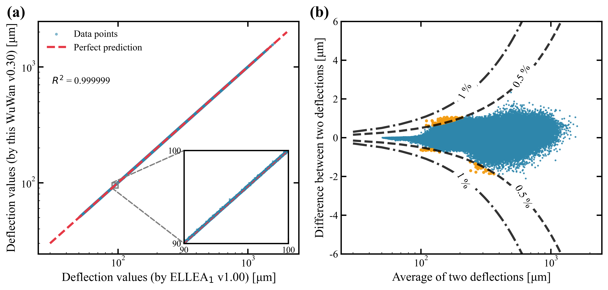

### 4. Large-Scale Back-Calculation Validation (500,000 Cases, No Error)

To verify that the inverse engine is mathematically consistent with the forward solver, the noise-free deflections from the same **500,000** randomly generated 5-layer structures were fed back into the back-calculation routine, and the recovered moduli were compared against the known "true" values.

**Figure (a)–(e)** plot predicted vs. true modulus for each layer. Every layer achieves a coefficient of determination of **$R^2 = 1.0000$**, with a Median Absolute Percentage Error (MdAPE) of:

| Layer | MdAPE | Max Error (isolated cases) |
| :---: | :--- | :--- |
| **1** | 0.0000% | — |
| **2** | 0.0000% | — |
| **3** | 0.0001% | 29.55% (True = 552 MPa) |
| **4** | 0.0001% | 117.57% (True = 105 MPa) |
| **5** | 0.0000% | — |

**Figure (f)** shows the per-layer relative error distribution: Layers 1, 2, and 5 stay tightly centered on zero, while Layers 3 and 4 — which contribute the least to the surface deflection basin — show a wider (but still sub-0.001%) spread.

**Figure (g)** breaks down the residual magnitude across all 500,000 cases on a log scale:

| log₁₀\|Residual\| Range | Percentage of Cases | Count |
| :--- | :--- | :--- |
| **< -16** (machine precision) | **65.11%** | 325,536 |
| **-16 to -12** | **34.88%** | 174,423 |
| **-12 to -9** | 0.00% | 23 |
| **-9 to -6** | 0.00% | 18 |

In other words, **99.99%** of the 500,000 structures are recovered to within floating-point precision. The handful of outlier cases (41 total) with larger residuals are confined to Layers 3 and 4, consistent with the known equifinality of layers that have weak influence on the measured surface deflection signal — the same effect already observed in the noisy back-calculation example below.

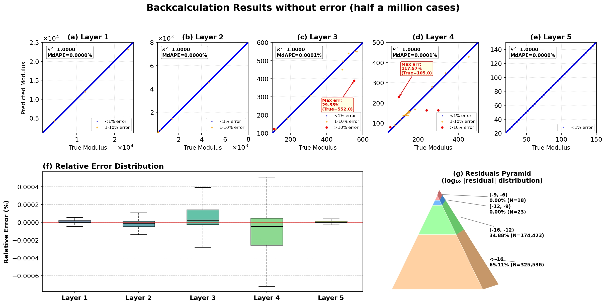

---

## ⚡ Quick Start: Forward Calculation

This example demonstrates how to perform a forward calculation for a 5-layer pavement system using **WuWanGUI**, the desktop front-end built on top of the same high-performance **WuWan** C++ backend.

### 1. Launch WuWanGUI and Select a Module

Launching `WuWan.py` opens the main menu, from which the user picks one of three analysis modules: **Forward Calculation**, **Back Calculation**, or **Sensor Location Optimization**.

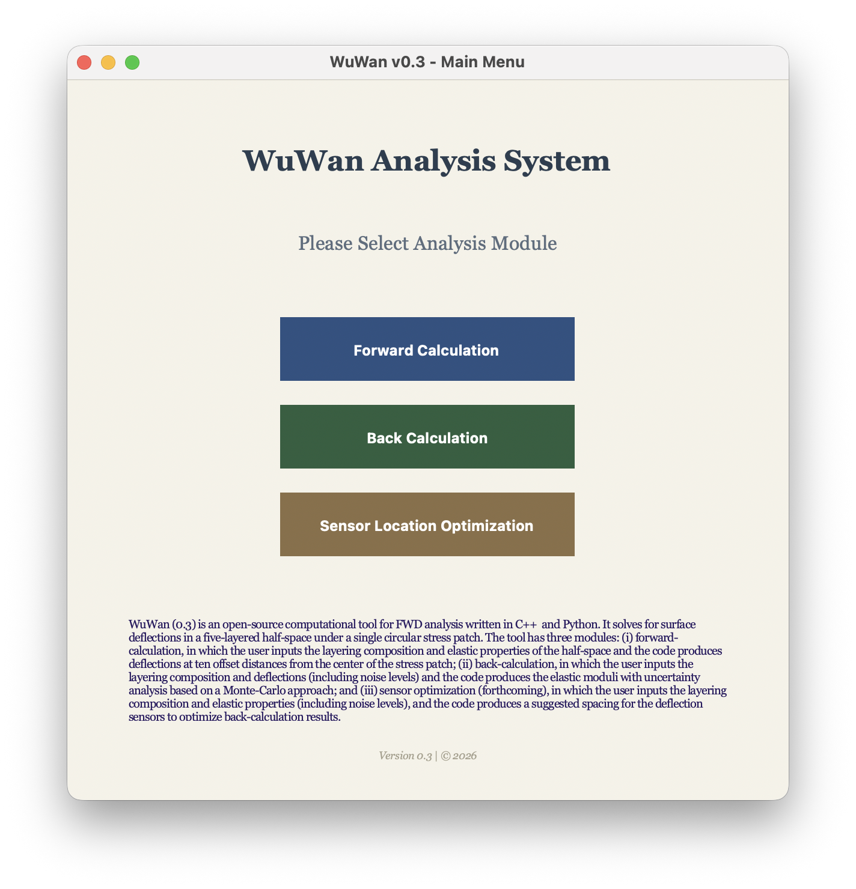

### 2. Define the Layered System and Compute

On the **Forward Calculation** page, the user fills in the editable cells (blue) of the layered system table — modulus, Poisson's ratio, and thickness for each of the 5 layers, plus the applied stress, load radius, and sensor offsets ($r$) for each evaluation point — then clicks **Compute!**.

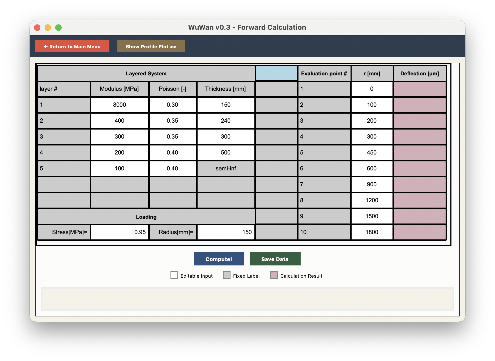

### 3. Output & Visualization

The deflection results (pink cells) are filled in instantly. Clicking **Show Profile Plot** reveals the deflection basin inline, alongside the input table:

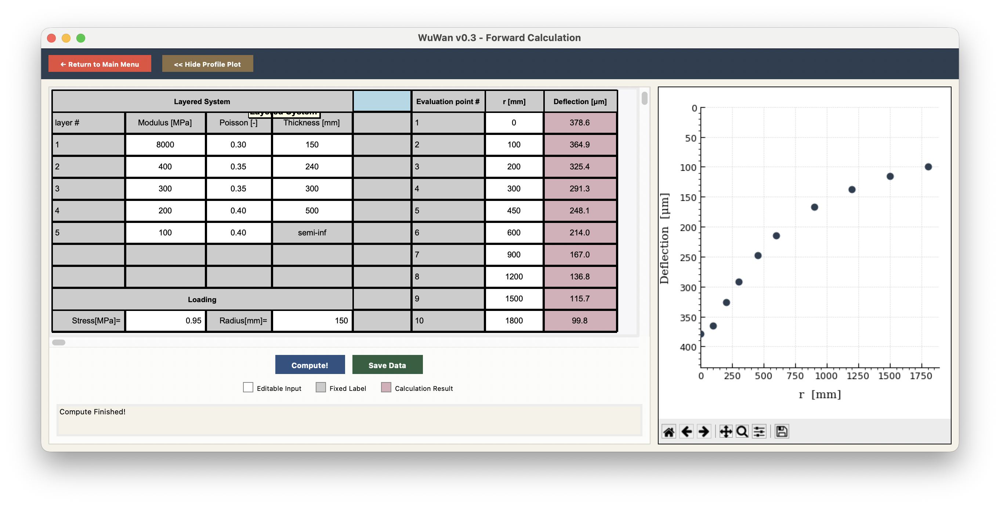

| Evaluation Point | $r$ [mm] | Deflection [μm] |
| :---: | :---: | :---: |
| 1 | 0 | 378.6 |
| 2 | 100 | 364.9 |
| 3 | 200 | 325.4 |
| 4 | 300 | 291.3 |
| 5 | 450 | 248.1 |
| 6 | 600 | 214.0 |
| 7 | 900 | 167.0 |
| 8 | 1200 | 136.8 |
| 9 | 1500 | 115.7 |
| 10 | 1800 | 99.8 |

## ⚡ Quick Start: Inverse Calculation (without error, perfect case)

This example demonstrates how to perform back-calculation (inversion) using the **Back Calculation** module of **WuWanGUI**, recovering layer moduli from a noise-free deflection basin.

### 1. Define the Deflection Bowl & Loading System

On the **Back Calculation** page, the user enters the load (Stress = 0.95 MPa, Radius = 150 mm) and the measured deflection at each of the 10 evaluation points. Here the deflection basin is generated directly from a known set of **"True" moduli** ($E_{true} = [8000, 400, 300, 200, 100]$ MPa), with no measurement noise injected.

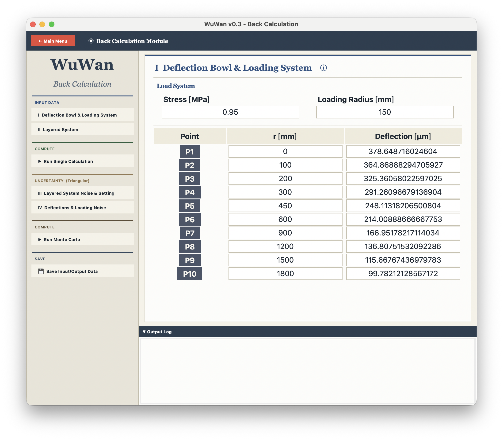

### 2. Define the Layered System (Initial Guess)

Next, the user provides the layer thicknesses, Poisson's ratios, and an **initial modulus guess** for the solver to start from — deliberately different from the true values, to test convergence. WuWanGUI also displays typical modulus ranges for common pavement layer types as a reference.

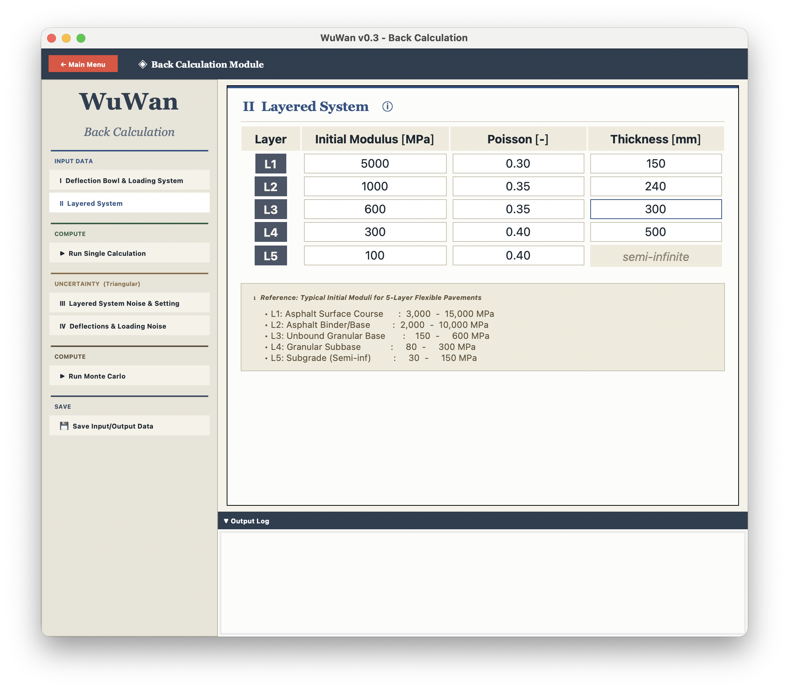

### 3. Run Single Calculation & Results

Clicking **Run Single Calculation** (no uncertainty / Monte Carlo sampling) recovers the best-fit elastic moduli from the deflection basin and renders the resulting layered profile.

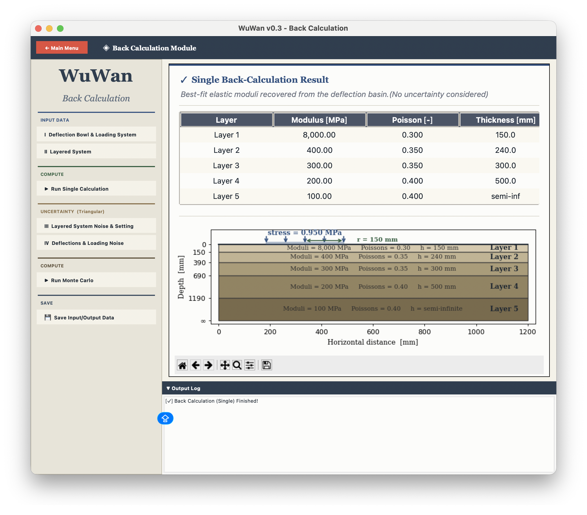

#### Modulus Comparison (True vs. Back-calculated)

| Layer | True Modulus ($E_{true}$) | Initial Guess ($E_0$) | **Calculated Modulus ($E_{calc}$)** | Deviation |
| :--- | :--- | :--- | :--- | :--- |
| **1 (Surface)** | 8000 MPa | 5000 MPa | **8000.00 MPa** | 0.0000% |
| **2 (Base)** | 400 MPa | 1000 MPa | **400.00 MPa** | 0.0000% |
| **3 (Subbase)** | 300 MPa | 600 MPa | **300.00 MPa** | 0.0000% |
| **4 (Soil)** | 200 MPa | 300 MPa | **200.00 MPa** | 0.0000% |
| **5 (Subgrade)** | 100 MPa | 100 MPa | **100.00 MPa** | 0.0000% |

> **Observation:** Since the deflection basin contains no error, every layer — including the deeper, less-sensitive Layers 3 and 4 — is recovered essentially exactly from the deliberately off initial guess. This isolates the intrinsic accuracy of the **WuWan** solver itself, separate from the effects of measurement noise.

---

## 🎲 Quick Start: Monte Carlo Back-Calculation (Uncertainty Analysis)

Building on the same **Back Calculation** module, this example quantifies how measurement uncertainty propagates into the recovered moduli. Instead of a single noise-free deflection basin, **WuWanGUI** repeatedly resamples randomized (triangular-distributed) noise on the layered system, the load, and the deflections, and re-runs the back-calculation for each trial.

### 1. Layered System Noise & Setting

In addition to the initial modulus guess, the user defines a **modulus search range** (lower/upper bound) per layer and a **thickness noise** (± mm) to be sampled for each Monte Carlo trial.

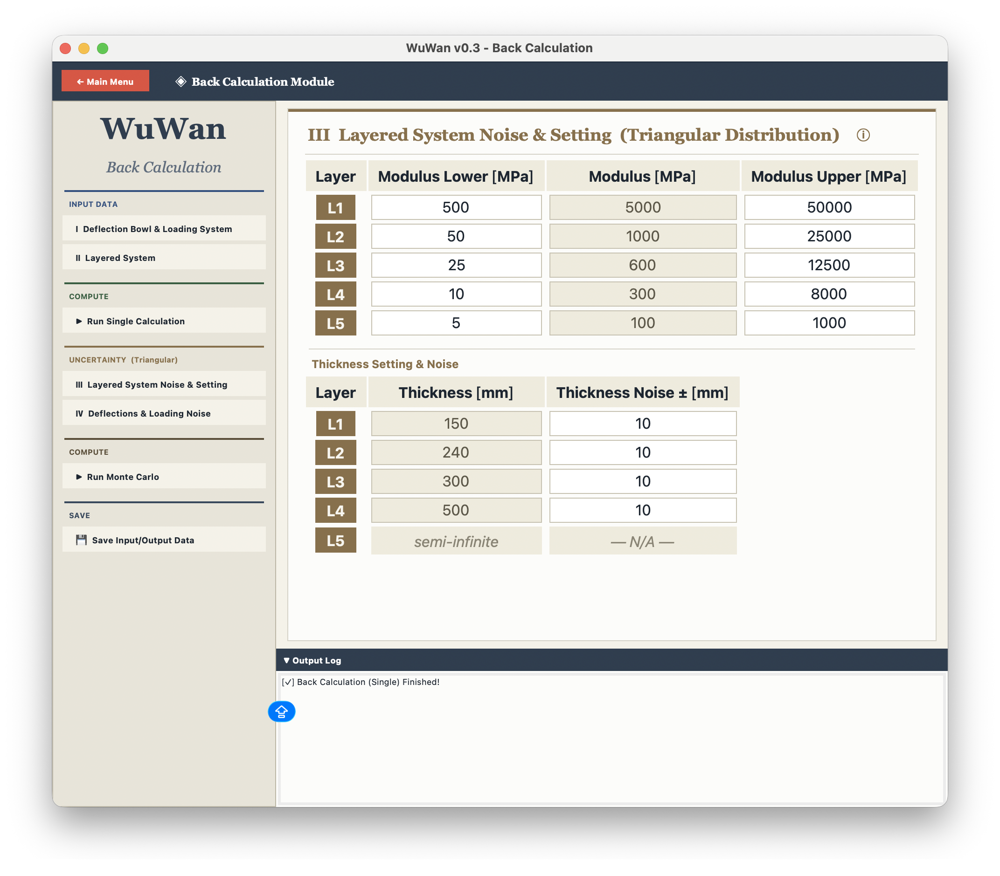

### 2. Deflections & Loading Noise Setting

The user also sets the **load (stress) noise level** and, per sensor, a **radial position noise** (r ± mm) and **deflection noise** (± μm) — simulating realistic FWD measurement uncertainty.

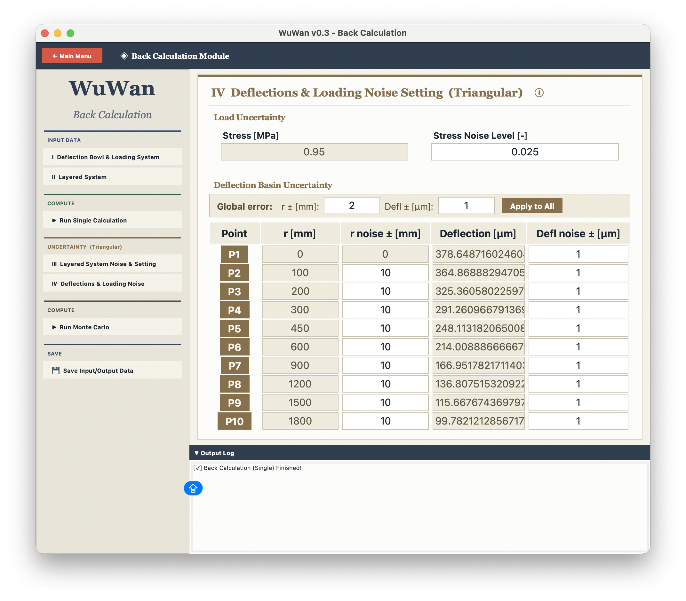

### 3. Run Monte Carlo & Results

Clicking **Run Monte Carlo** repeats the back-calculation **N = 1200** times, each with a freshly sampled noise realization, and plots the resulting distribution of recovered elastic moduli per layer as violin plots (95% CI, IQR, mean, and median).

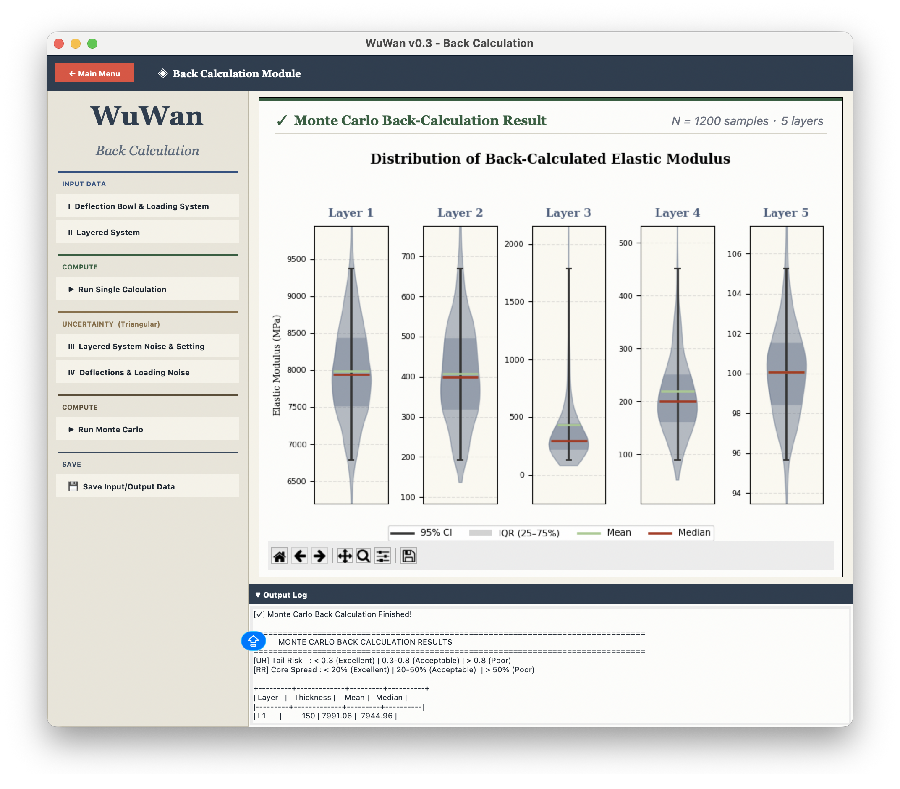

#### Uncertainty Summary

[UR] Tail Risk: **< 0.3** Excellent | 0.3–0.8 Acceptable | **> 0.8** Poor.
[RR] Core Spread: **< 20%** Excellent | 20–50% Acceptable | **> 50%** Poor.

| Layer | Thickness [mm] | Mean [MPa] | Median [MPa] | CI (2.5%) | CI (97.5%) | UR | RR (%) |
| :--- | :---: | :---: | :---: | :---: | :---: | :---: | :---: |
| **L1** | 150 | 7991.06 | 7944.96 | 6780.16 | 9366.88 | -0.107 | **11.63** |
| **L2** | 240 | 408.60 | 399.58 | 191.49 | 668.78 | -0.215 | **44.38** |
| **L3** | 300 | 434.42 | 299.06 | 126.29 | 1783.63 | 4.389 | **75.97** |
| **L4** | 500 | 219.14 | 200.13 | 88.70 | 450.71 | 1.112 | **45.02** |
| **L5** | semi-inf | 100.07 | 100.08 | 95.63 | 105.23 | 0.181 | **3.11** |

> **Observation:** The subgrade (Layer 5) is recovered with **excellent** core spread (RR = 3.11%) despite the injected noise, while Layer 3 — the layer with the least influence on the surface deflection basin — shows a **poor** core spread (RR = 75.97%) and the largest tail risk (UR = 4.39). This mirrors the equifinality already seen in the half-million-case validation above: layers with weak sensitivity to surface deflections are inherently harder to pin down once measurement noise is introduced, even though the underlying solver itself is exact.

---

## 🎯 Quick Start: Sensor Location Optimization

This example demonstrates the **Sensor Location Optimization** module, which searches for the FWD sensor radii ($r$) that maximize the information content of the deflection basin for back-calculation, under realistic uncertainty in the layered system, load, and measurement noise.

### 1. Define the Deflection Bowl, Loading & Layered System

As with the Back Calculation module, the user starts from a measured deflection basin (Stress = 0.95 MPa, Radius = 150 mm) and the corresponding layered system (initial moduli, Poisson's ratios, thicknesses). An optional **"True Modulus"** row lets the user compare the optimization against known reference values.

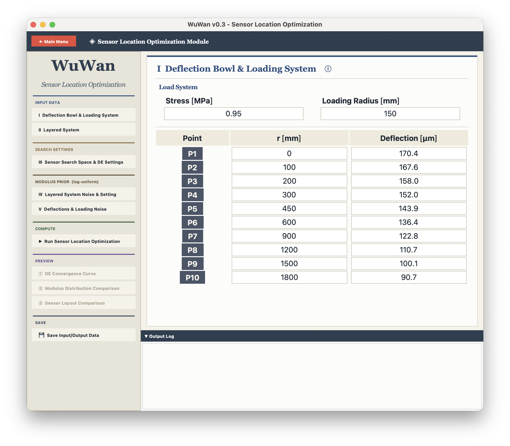
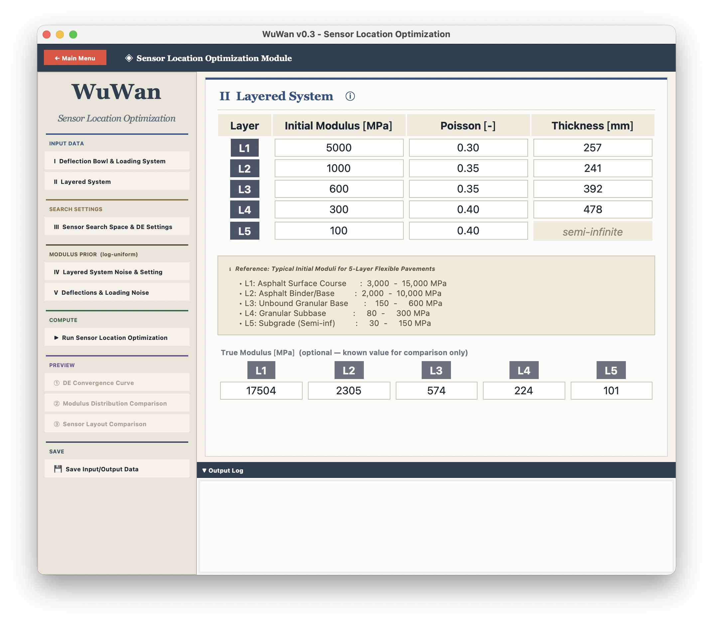

### 2. Sensor Search Space & DE Settings

The user sets how many sensors are **fixed** (kept at their original positions) vs. **free** to move, the allowable search range $[r_{min}, r_{max}]$, the minimum spacing between sensors, and the Differential Evolution (DE) solver settings (population size, iterations, tolerance, random seed).

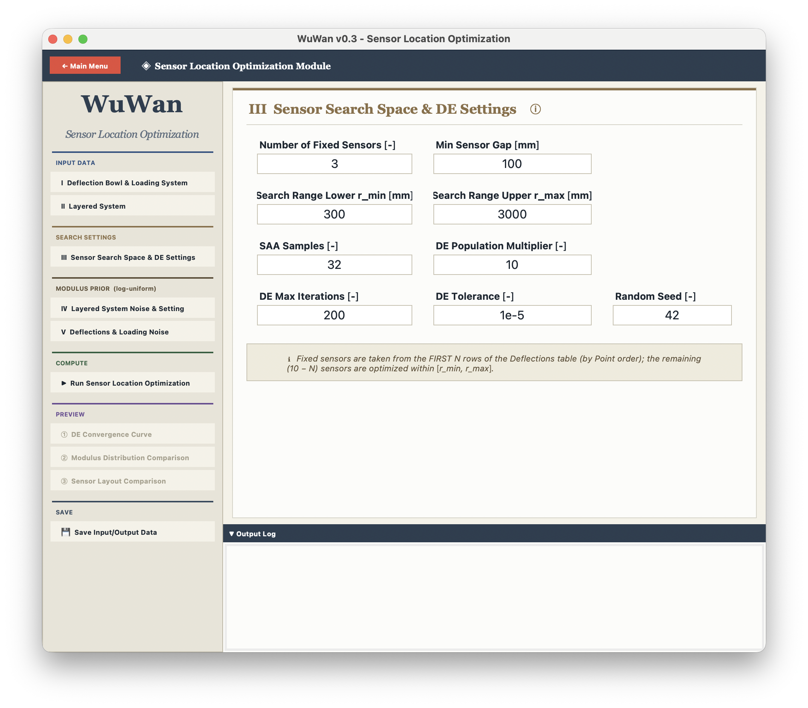

### 3. Layered System & Deflection/Loading Noise

Just like the Monte Carlo back-calculation, the modulus search range, thickness noise, load noise, and per-sensor deflection noise are defined as triangular-distributed priors. These define the uncertainty that the optimizer is made **robust** against.

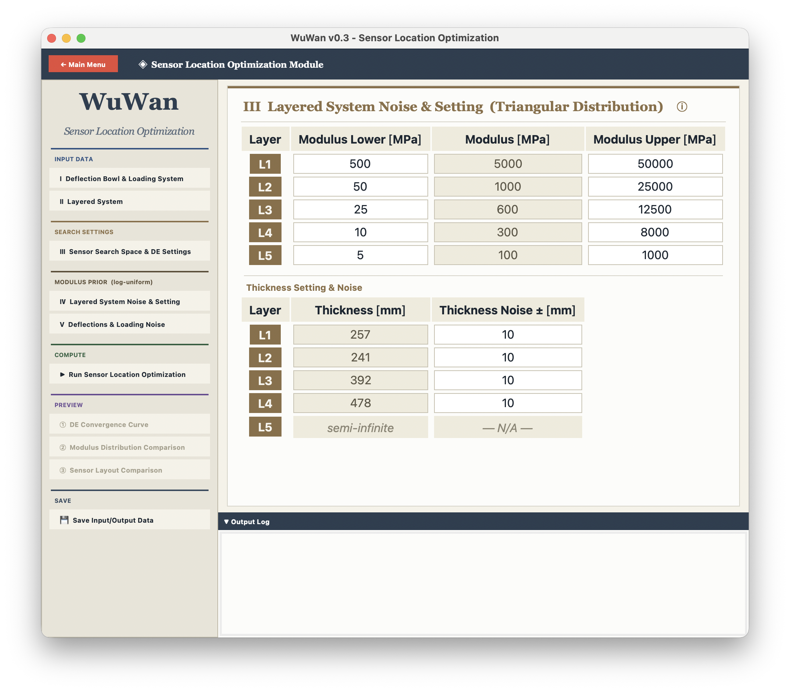
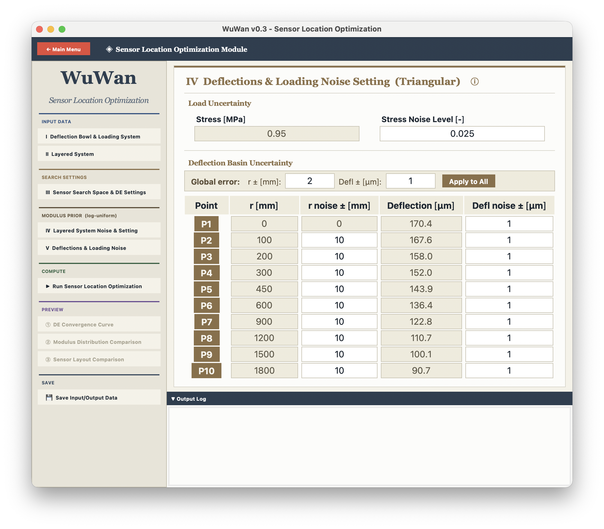

### 4. Run Optimization & Results

Clicking **Run Sensor Location Optimization** performs a robust D-optimal search (Differential Evolution over a Sample Average Approximation of the expected Fisher Information) that keeps the first 3 sensors fixed and repositions the remaining 7 within $[300, 3000]$ mm, subject to a 100 mm minimum gap.

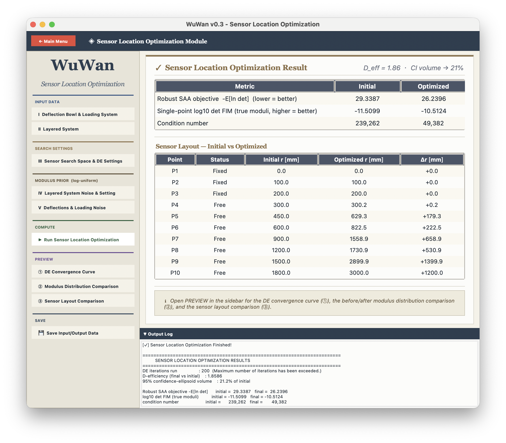

#### Optimization Metrics (Initial vs. Optimized)

| Metric | Initial | Optimized |
| :--- | :---: | :---: |
| Robust SAA objective $-E[\ln\det]$ (lower is better) | 29.3387 | **26.2396** |
| $\log_{10}\det(\text{FIM})$ at true moduli (higher is better) | -11.5099 | **-10.5124** |
| Condition number | 239,262 | **49,382** |

This corresponds to a **D-efficiency of 1.86×** relative to the initial layout, shrinking the 95% confidence-ellipsoid volume of the recovered moduli to **21.2%** of its original size.

#### Sensor Layout — Initial vs. Optimized

| Point | Status | Initial $r$ [mm] | Optimized $r$ [mm] | $\Delta r$ [mm] |
| :---: | :---: | :---: | :---: | :---: |
| P1 | Fixed | 0.0 | 0.0 | +0.0 |
| P2 | Fixed | 100.0 | 100.0 | +0.0 |
| P3 | Fixed | 200.0 | 200.0 | +0.0 |
| P4 | Free | 300.0 | 300.2 | +0.2 |
| P5 | Free | 450.0 | 629.3 | +179.3 |
| P6 | Free | 600.0 | 822.5 | +222.5 |
| P7 | Free | 900.0 | 1558.9 | +658.9 |
| P8 | Free | 1200.0 | 1730.9 | +530.9 |
| P9 | Free | 1500.0 | 2899.9 | +1399.9 |
| P10 | Free | 1800.0 | 3000.0 | +1200.0 |

> **Observation:** The optimizer pushes the free sensors outward, toward the edge of the allowed search range, since the deepest/least-sensitive layers (Layer 3 and 4 — see the validation and Monte Carlo sections above) are best identified by sensors farther from the load, where their relative contribution to the deflection basin is largest.

### 5. Preview: Convergence, Modulus & Layout Comparison

WuWanGUI's **Preview** tab provides three additional diagnostic plots once the optimization finishes:

**DE Convergence Curve** — tracks the D-efficiency of the candidate layout (relative to the initial layout) over the 200 DE iterations.

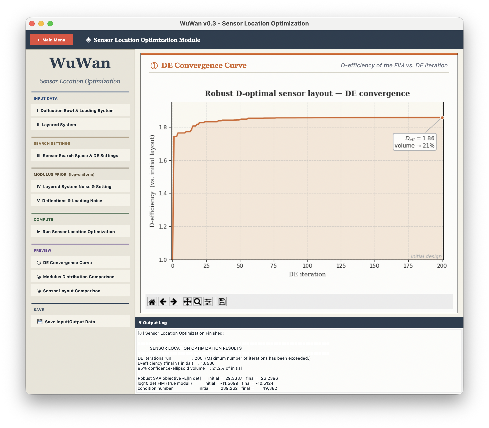

**Modulus Distribution Comparison** — re-runs the Monte Carlo back-calculation under the *initial* and *optimized* sensor layouts side by side, showing how the optimized layout narrows the recovered modulus distribution for every layer.

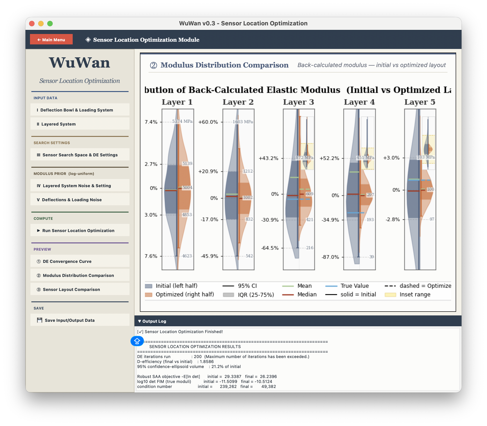

**Sensor Layout Comparison** — visualizes the initial (top) vs. optimized (bottom) sensor positions along the radial axis.

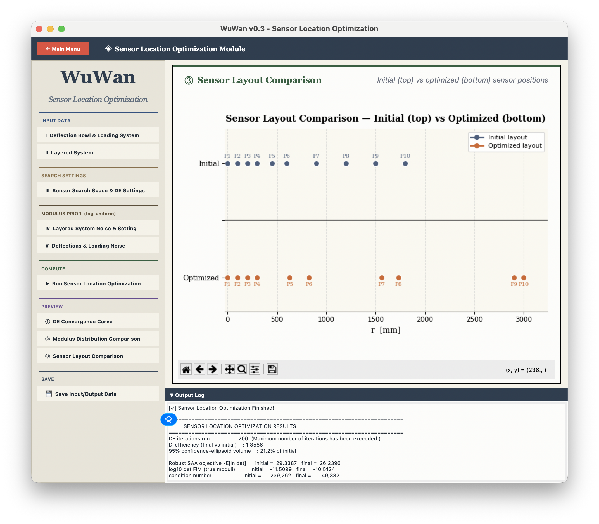

---

## 📖 Documentation

For comprehensive guidance on using WuWan:

- **API Reference**: Detailed documentation of all classes and methods
- **Tutorials**: Step-by-step examples in the `examples/` directory
- **Theory**: Mathematical derivations and implementation details in `docs/theory.pdf`
- **FAQ**: Common questions and troubleshooting tips

---

## 🔮 Roadmap

- [x] **C++ Core Rewrite**: Transformed from Cython to C++ with Eigen/Boost.
- [x] **Forward Calculation & Analytical Gradients**: Implementation of high-speed forward modeling and derivative calculation.
- [x] **Deterministic Back-calculation**: Fast inverse analysis for moduli estimation.
- [x] **Monte Carlo Uncertainty Analysis**: Triangular-distributed noise injection on thickness, load, sensor position, and deflection, with UR/RR risk-spread reporting per layer.
- [x] **Sensor Location Optimization**: Robust D-optimal sensor placement via Differential Evolution over a Sample Average Approximation of the Fisher Information Matrix. *This is a **pioneer / preliminary release** of the module — the search heuristics and robustness criteria are still being refined in future versions.*

---

## 📄 License

This project is licensed under the **Apache License 2.0** - see the [LICENSE](LICENSE) file for details.

You are free to use, modify, and distribute this software for both commercial and non-commercial purposes, subject to the terms of the license.

---

## 🙏 Acknowledgments

WuWan builds upon decades of research in layered elastic theory and pavement mechanics:

- **Libraries**: Built with [Eigen](https://eigen.tuxfamily.org), [Boost](https://www.boost.org), and [pybind11](https://pybind11.readthedocs.io)
- **Validation**: Benchmarked against [ELLEA](https://findit.dtu.dk/en/catalog/689b3af6d060d500e9ed1ce2) by Technical University of Denmark
- **Theory**: Inspired by foundational work from:
  - Levenberg, E. (2020) - Pavement Mechanics: Lecture Notes
  - Huang, Y.H. (2004) - Pavement Analysis and Design
  - Ullidtz, P. (1998) - Modelling Flexible Pavement Response and Performance

Special thanks to all contributors and the pavement engineering research community.

---

## 🌟 Star History

If you find WuWan useful, please consider giving it a star on GitHub! It helps others discover the project and motivates continued development.

---

**Made with ❤️ for pavement engineers and researchers worldwide**